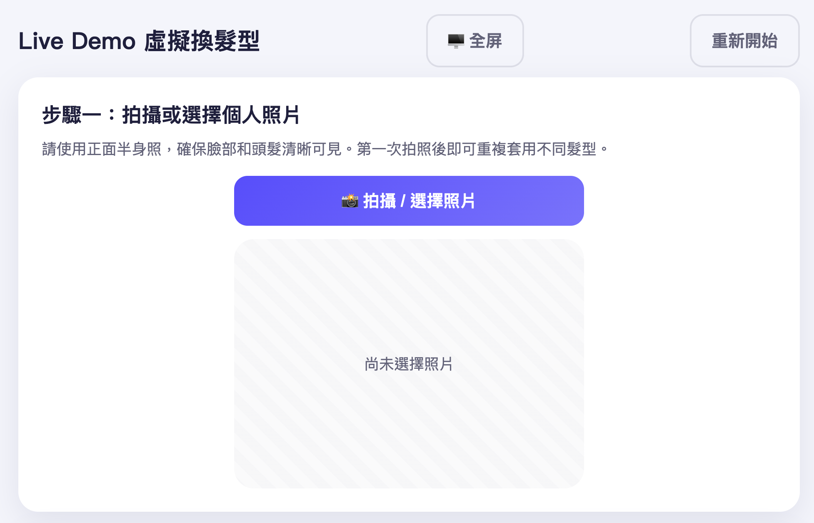
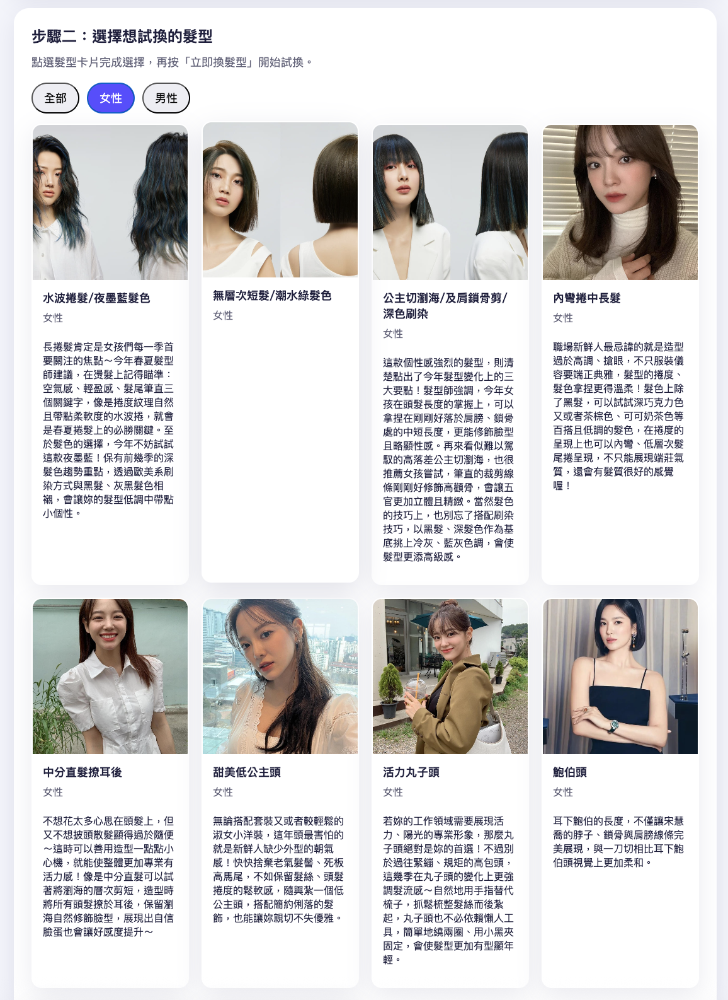
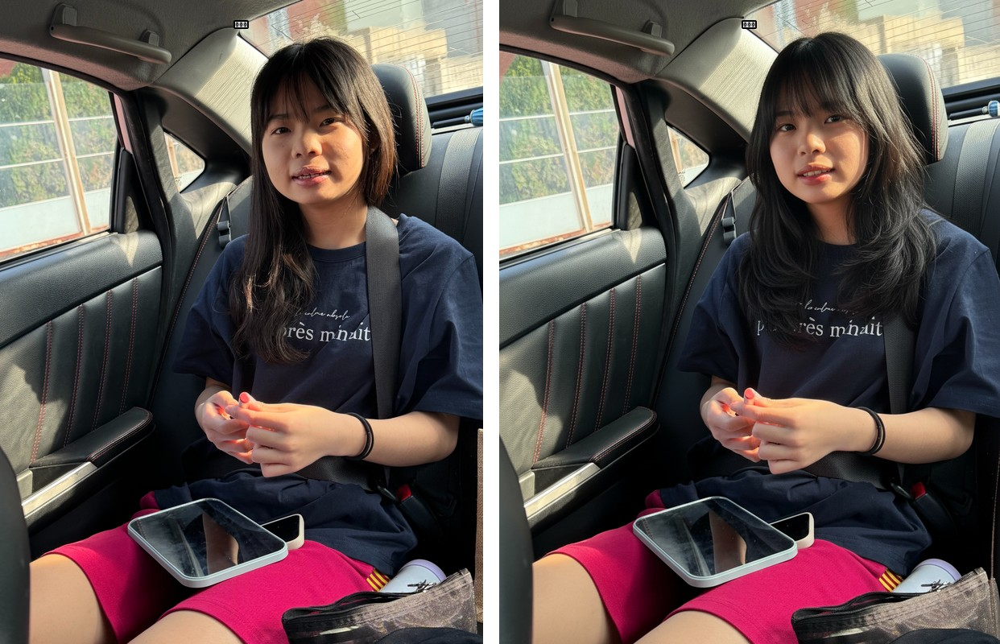
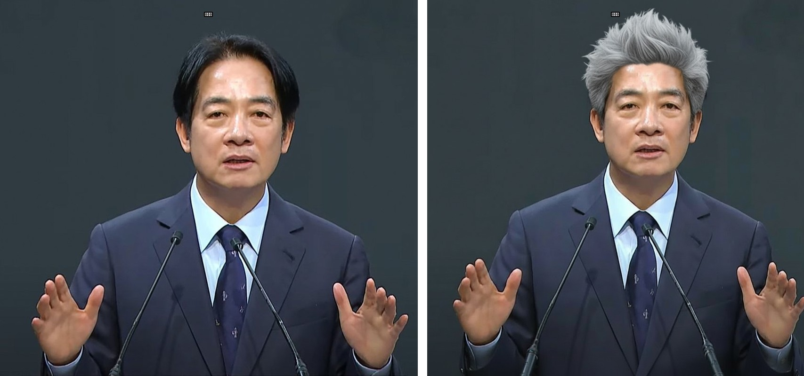

# AI-Hair-Salon 🎨✂️


> Virtual hair try-on system powered by Google Gemini AI. Change hairstyles precisely while keeping face, body, and clothes unchanged.

[English](#english) | [中文](#中文)

## 📸 Demo Screenshots

### Step 1: Upload Your Photo


### Step 2: Choose a Hairstyle


### Step 3: View Results


### Another Example


---

## English

### 🌟 Features

- **Precision AI Technology**: Uses Google Gemini's two-stage image generation to ensure ONLY the hairstyle changes
- **Full Body Support**: Works with both portrait and full-body photos while preserving clothing
- **Before/After Comparison**: View results with before, after, and side-by-side comparison
- **Full-Screen Viewer**: Swipe through results in an immersive full-screen experience
- **Photo Rotation**: Rotate uploaded photos 90°, 180°, or 270° before processing
- **Video Generation**: Create dynamic videos showcasing the new hairstyle (powered by KlingAI)
- **Photo Validation**: AI-powered validation ensures proper photo format (front-facing, half-body shots)
- **Admin Dashboard**: Manage hairstyle library, view history, and configure settings
- **Touch-Friendly UI**: Responsive design optimized for tablets and touch screens

### 🛠️ Tech Stack

- **Backend**: Python 3.9+, Flask
- **AI Engine**: Google Gemini API (gemini-2.5-flash-image, gemini-2.5-flash)
- **Video AI**: KlingAI Video Service
- **Frontend**: Vanilla JavaScript, Modern CSS
- **Image Processing**: PIL/Pillow

### 📋 Requirements

- Python 3.9 or higher
- Google Gemini API Key ([Get one here](https://ai.google.dev/))
- (Optional) KlingAI API Key for video generation

### 🚀 Quick Start

#### 1. Clone the Repository

```bash
git clone https://github.com/ch-neural/AI-Hair-Salon.git
cd AI-Hair-Salon
```

#### 2. Set Up Virtual Environment

```bash
python3 -m venv venv_m4
source venv_m4/bin/activate  # On Windows: venv_m4\Scripts\activate
```

#### 3. Install Dependencies

```bash
pip install -r requirements.txt
```

#### 4. Configure API Keys

Create a `data/settings.json` file:

```json
{
  "GEMINI_API_KEY": "your-gemini-api-key-here",
  "GEMINI_MODEL": "gemini-2.5-flash-image",
  "GEMINI_LLM": "gemini-2.5-flash",
  "GEMINI_SAFETY_SETTINGS": "BLOCK_ONLY_HIGH",
  "VENDOR_TRYON": "Gemini",
  "VENDOR_VIDEO": "KlingAI",
  "KLINGAI_ACCESS_KEY": "your-klingai-key-here",
  "KLINGAI_SECRET_KEY": "your-klingai-secret-here",
  "LLM_ENABLED": true
}
```

**⚠️ Important**: Never commit `data/settings.json` to Git. It's already in `.gitignore`.

#### 5. Run the Application

```bash
./start.sh
# Or manually:
# python3 app.py
```

#### 6. Access the Application

- **User Interface**: http://localhost:6055
- **Admin Dashboard**: http://localhost:6055/admin
  - Username: `admin`
  - Password: `storepi`

### 📖 How to Use

1. **Upload Your Photo**: Take or select a front-facing photo (half-body recommended)
2. **Choose a Hairstyle**: Browse and select from the hairstyle library
3. **Generate Result**: Click "立即換髮型" (Try Hairstyle Now) and wait 20-30 seconds
4. **View Results**: Switch between before, after, and comparison views
5. **(Optional) Generate Video**: Create a dynamic video showing the new hairstyle

### 🎯 How It Works

AI-Hair-Salon uses a sophisticated **two-stage AI process**:

#### Stage 1: Intelligent Description
- Gemini LLM analyzes both your photo and the selected hairstyle
- Generates a detailed text description focusing ONLY on the hair
- Explicitly instructs to preserve face, body, clothing, and background

#### Stage 2: Precision Generation
- Gemini Image Model generates the final image based on the description
- Uses strict constraints to ensure pixel-perfect preservation of everything except hair
- Validates output to confirm identity preservation

This two-stage approach provides superior control compared to single-stage generation, ensuring the AI changes ONLY the hairstyle while keeping everything else identical.

### 📁 Project Structure

```
AI-Hair-Salon/
├── app.py                 # Main Flask application
├── config.py              # Configuration management
├── start.sh               # Startup script
├── requirements.txt       # Python dependencies
├── routes/
│   ├── user.py           # User-facing routes
│   ├── admin.py          # Admin dashboard routes
│   └── api.py            # API endpoints for try-on
├── services/
│   ├── photo_service.py  # Photo processing
│   ├── photo_validator.py # AI photo validation
│   ├── video_service.py  # Video generation
│   ├── garment_repository.py # Hairstyle data management
│   └── history_repository.py # History tracking
├── templates/            # HTML templates
├── static/
│   ├── css/             # Stylesheets
│   ├── js/              # JavaScript
│   ├── garments/        # Hairstyle image library
│   ├── inputs/          # Uploaded user photos (gitignored)
│   └── outputs/         # Generated results (gitignored)
└── data/
    ├── settings.json    # API keys and config (gitignored)
    ├── garments.json    # Hairstyle metadata
    └── tryon_history.json # Usage history (gitignored)
```

### 🔧 Configuration

Edit `data/settings.json` to customize:

- **Gemini Models**: Choose different Gemini models for text/image generation
- **Safety Settings**: Adjust content filtering (BLOCK_NONE, BLOCK_ONLY_HIGH, etc.)
- **Try-On Vendor**: Switch between Gemini or KlingAI for try-on
- **Video Settings**: Configure video generation parameters
- **LLM Features**: Enable/disable photo validation and advanced analysis

### 📸 Screenshots

<!-- Add screenshots here -->
*Screenshots coming soon...*

### 🤝 Contributing

Contributions are welcome! Please feel free to submit a Pull Request.

1. Fork the repository
2. Create your feature branch (`git checkout -b feature/AmazingFeature`)
3. Commit your changes (`git commit -m 'Add some AmazingFeature'`)
4. Push to the branch (`git push origin feature/AmazingFeature`)
5. Open a Pull Request

### 📝 License

This project is licensed under the MIT License - see the [LICENSE](LICENSE) file for details.

### 🙏 Acknowledgments

- [Google Gemini AI](https://ai.google.dev/) for powerful image generation
- [KlingAI](https://klingai.com/) for video generation capabilities
- Flask community for excellent web framework

### 📧 Contact

- GitHub: [@ch-neural](https://github.com/ch-neural)
- Project Link: [https://github.com/ch-neural/AI-Hair-Salon](https://github.com/ch-neural/AI-Hair-Salon)

### ⚠️ Disclaimer

This project is for educational and personal use. Generated images should be used responsibly. The quality of results depends on the input photo and selected hairstyle.

---

## 中文

### 🌟 功能特點

- **精準 AI 技術**：使用 Google Gemini 的兩階段圖像生成，確保「只」改變髮型
- **全身照支持**：支持半身照和全身照，完美保留衣物
- **前後對比**：查看試髮前、試髮後和並排對比
- **全屏查看器**：沉浸式全屏體驗，左右滑動切換圖片
- **照片旋轉**：處理前可將照片旋轉 90°、180° 或 270°
- **影片生成**：創建展示新髮型的動態影片（由 KlingAI 驅動）
- **照片驗證**：AI 驗證確保照片格式正確（正面、半身照）
- **管理後台**：管理髮型庫、查看歷史記錄和配置設置
- **觸控友好**：針對平板和觸控螢幕優化的響應式設計

### 🛠️ 技術棧

- **後端**：Python 3.9+、Flask
- **AI 引擎**：Google Gemini API（gemini-2.5-flash-image、gemini-2.5-flash）
- **影片 AI**：KlingAI Video Service
- **前端**：原生 JavaScript、現代 CSS
- **圖像處理**：PIL/Pillow

### 📋 系統需求

- Python 3.9 或更高版本
- Google Gemini API Key（[點此申請](https://ai.google.dev/)）
- （可選）KlingAI API Key 用於影片生成

### 🚀 快速開始

#### 1. 克隆倉庫

```bash
git clone https://github.com/ch-neural/AI-Hair-Salon.git
cd AI-Hair-Salon
```

#### 2. 設置虛擬環境

```bash
python3 -m venv venv_m4
source venv_m4/bin/activate  # Windows 系統：venv_m4\Scripts\activate
```

#### 3. 安裝依賴

```bash
pip install -r requirements.txt
```

#### 4. 配置 API Key

創建 `data/settings.json` 文件：

```json
{
  "GEMINI_API_KEY": "你的-gemini-api-key",
  "GEMINI_MODEL": "gemini-2.5-flash-image",
  "GEMINI_LLM": "gemini-2.5-flash",
  "GEMINI_SAFETY_SETTINGS": "BLOCK_ONLY_HIGH",
  "VENDOR_TRYON": "Gemini",
  "VENDOR_VIDEO": "KlingAI",
  "KLINGAI_ACCESS_KEY": "你的-klingai-key",
  "KLINGAI_SECRET_KEY": "你的-klingai-secret",
  "LLM_ENABLED": true
}
```

**⚠️ 重要**：切勿將 `data/settings.json` 提交到 Git。它已在 `.gitignore` 中。

#### 5. 運行應用

```bash
./start.sh
# 或手動運行：
# python3 app.py
```

#### 6. 訪問應用

- **用戶界面**：http://localhost:6055
- **管理後台**：http://localhost:6055/admin
  - 用戶名：`admin`
  - 密碼：`storepi`

### 📖 使用方法

1. **上傳照片**：拍攝或選擇正面照（建議半身照）
2. **選擇髮型**：瀏覽並選擇髮型庫中的髮型
3. **生成結果**：點擊「立即換髮型」並等待 20-30 秒
4. **查看結果**：在試髮前、試髮後和對比視圖之間切換
5. **（可選）生成影片**：創建展示新髮型的動態影片

### 🎯 工作原理

AI-Hair-Salon 使用精密的**兩階段 AI 流程**：

#### 階段一：智能描述
- Gemini LLM 分析您的照片和選定的髮型
- 生成「只」關注頭髮的詳細文字描述
- 明確指示保留臉部、身體、衣物和背景

#### 階段二：精準生成
- Gemini 圖像模型根據描述生成最終圖像
- 使用嚴格約束確保除頭髮外的所有元素像素級完美保留
- 驗證輸出以確認身份保留

這種兩階段方法相比單階段生成提供了卓越的控制力，確保 AI「只」改變髮型，保持其他一切完全相同。

### 🤝 貢獻

歡迎貢獻！請隨時提交 Pull Request。

### 📝 授權

本項目採用 MIT 授權 - 詳見 [LICENSE](LICENSE) 文件。

### 📧 聯繫方式

- GitHub：[@ch-neural](https://github.com/ch-neural)
- 項目鏈接：[https://github.com/ch-neural/AI-Hair-Salon](https://github.com/ch-neural/AI-Hair-Salon)

### ⚠️ 免責聲明

本項目僅供教育和個人使用。生成的圖像應負責任地使用。結果質量取決於輸入照片和所選髮型。

---

**Made with ❤️ and AI**
